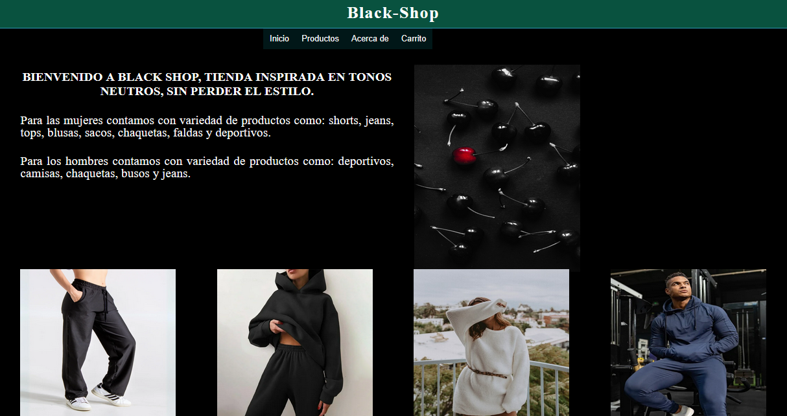
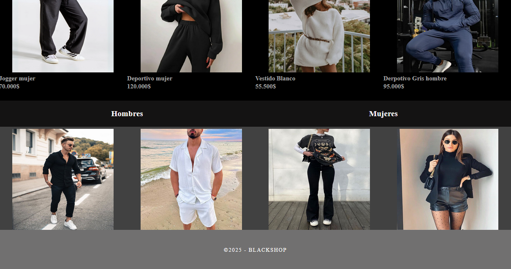
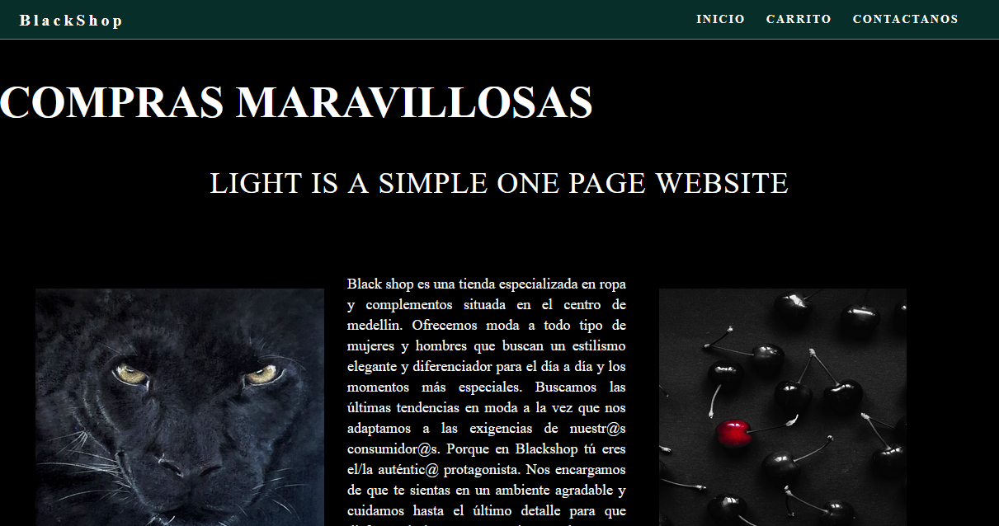
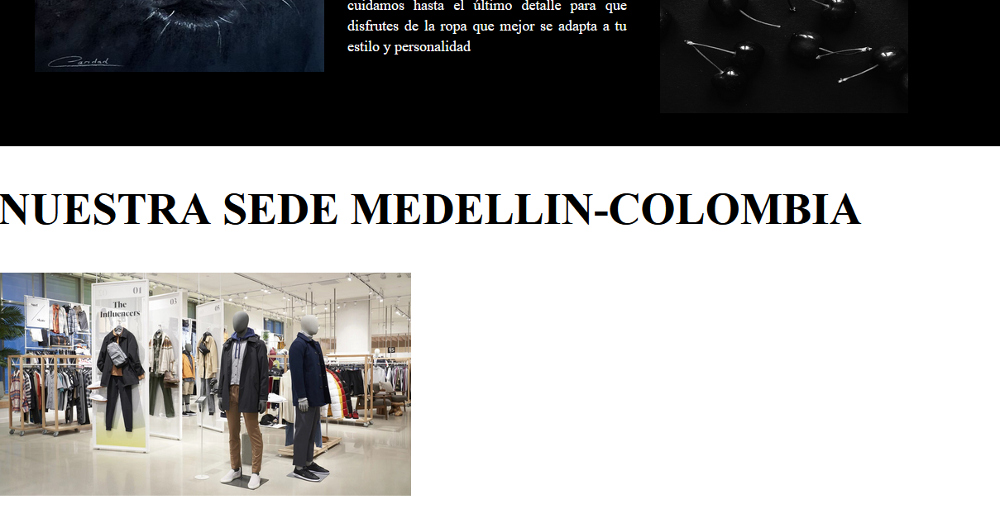
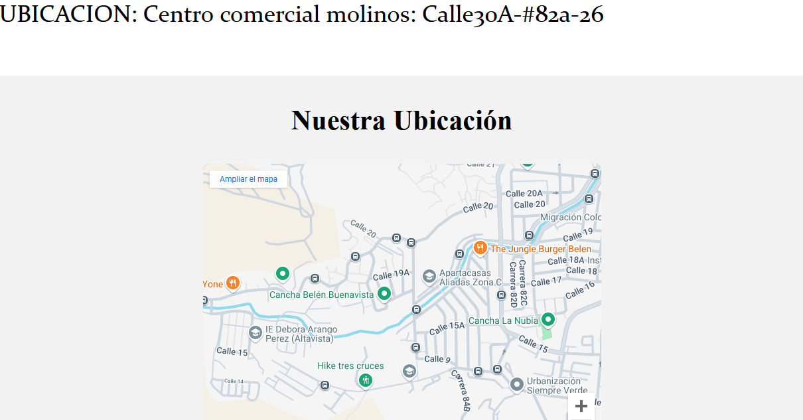
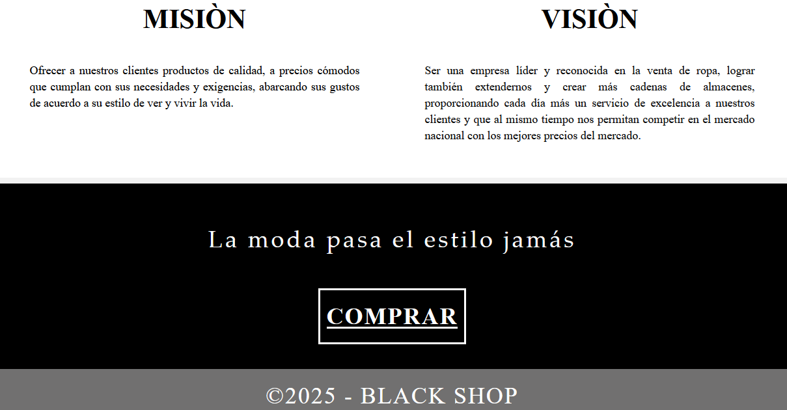
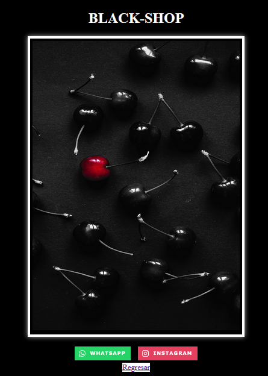

## Español
## Pagina blackshop

El diseño de esta pagina, es una simulación de un negocio de ropa para hombres y mujeres, incluye navegación basica entre paginas por medio de botones, y hipervinculos.
Uso de diferentes contenedores, estilos de letra e imagenes, con efectos adicionales como el Google maps, utilizamos menús tipo "desplegable" o "jerarquico" y efecto "hover reveal" o "hover-triggered visibility".

## English
## Page blackshop
The design of this page is a simulation of a clothing store for men and women, including basic navigation between pages through buttons and hyperlinks.
We use different containers, font styles and images, with additional effects such as Google maps, we use "drop-down" or "hierarchical" menus and a "hover reveal" or "hover-triggered visibility" effect.

## Below are photos of the final design

## video of the "hover reveal" or "hover-triggered visibility" effect.

[🎥 Ver video](images/video.WEBM)

